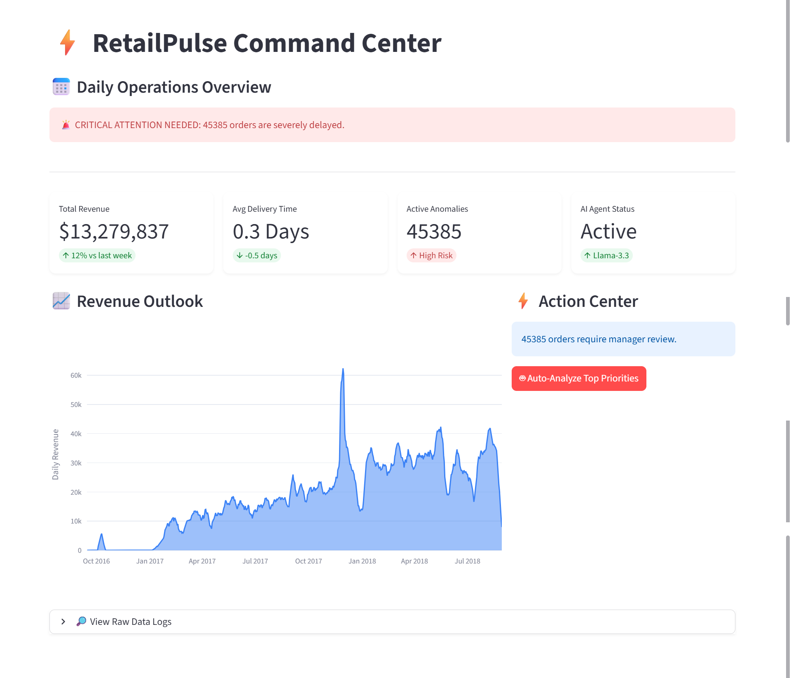
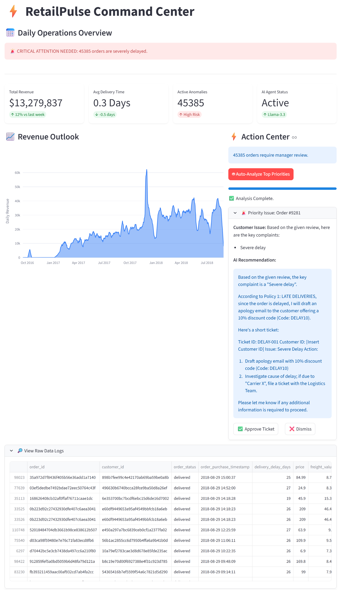

# ⚡ RetailPulse: AI-Driven Supply Chain Command Center


**RetailPulse** is an operational intelligence platform that automates supply chain decision-making. Unlike traditional dashboards that only *display* data, RetailPulse *acts* on it using a hybrid architecture of Traditional Machine Learning (XGBoost) and Generative AI Agents (Llama-3.3).

---

## 🏗️ Architecture

The system is built as a microservices application using Docker Compose.

```mermaid
graph TD
    User[User / Operations Manager] -->|Interacts| UI[Streamlit Dashboard]
    
    subgraph "Application Container"
        UI -->|Triggers| MLE[ML Engine (XGBoost + IsoForest)]
        UI -->|Consults| Agent[AI Agent Orchestrator]
        
        Agent -->|Summarizes| Worker[Worker LLM (Llama-3.1-8B)]
        Agent -->|Decides| Manager[Manager LLM (Llama-3.3-70B)]
        Agent <-->|Retrieves Policy| RAG[(ChromaDB Vector Store)]
    end
    
    subgraph "Data Container"
        MLE <-->|Reads/Writes| DB[(PostgreSQL Database)]
    end

```

---

## 📊 RetailPulse Command Center

Below is a preview of the **RetailPulse AI-Driven Operations Dashboard**, built with Streamlit.  
The interface enables operations managers to monitor system health, detect risks, and trigger AI-driven resolutions in real time.

### 🖥️ Daily Operations Overview



**Highlights:**
- Real-time KPI monitoring (Revenue, Delivery Time, Active Anomalies)
- Critical alerts for large-scale delivery failures
- Live AI Agent health and model status (Llama-3.3)

---

### ⚡ AI Action Center & Automated Resolution



**What’s happening here:**
- High-risk orders are automatically prioritized by the Manager Agent
- Relevant SOPs are retrieved via RAG (Vector Database)
- Actionable resolution tickets are generated (refunds, apologies, escalation)
- Human-in-the-loop approval ensures enterprise safety and control

---


## 🚀 Key Features

### 1. 🔮 Demand Forecasting (XGBoost)

* **Problem:** Inventory shortages due to unpredictable demand.
* **Solution:** Trained an XGBoost Regressor on historical sales data to predict daily order volume with **±12% MAPE** (Mean Absolute Percentage Error).

### 2. 🕵️‍♂️ Anomaly Detection (Isolation Forest)

* **Problem:** "Silent" operational failures (e.g., high shipping costs with zero revenue).
* **Solution:** An unsupervised Isolation Forest model scans incoming orders to flag multi-dimensional outliers (Price vs. Delay vs. Freight) that simple threshold rules miss.

### 3. 🤖 The Multi-Agent AI System

* **Worker Agent (Llama-3.1-8B):** Reads hundreds of raw customer reviews and extracts structured "Complaint Objects" (e.g., `{"issue": "late_delivery", "sentiment": "negative"}`).
* **Manager Agent (Llama-3.3-70B + RAG):**
* **Retrieval:** Searches the `SOP_Manual.pdf` (Vector DB) for the relevant company policy.
* **Decision:** Synthesizes the complaint + policy to draft an actionable resolution ticket (e.g., "Authorize 10% refund per Policy 4B").


---

## 🛠️ Tech Stack

* **Core:** Python 3.10
* **Database:** PostgreSQL 15 (Dockerized)
* **ML Engine:** Scikit-Learn, XGBoost
* **AI Orchestration:** LangChain, ChromaDB
* **LLM Provider:** Groq Cloud API (Llama 3.3)
* **Infrastructure:** Docker & Docker Compose

---

## ⚡ How to Run

You do not need to install Python or PostgreSQL. You only need **Docker**.

**1. Clone the Repository**

```bash
git clone [https://github.com/PranavKndpl/RetailPulse](https://github.com/PranavKndpl/RetailPulse)
cd retail-pulse

```

**2. Configure Secrets**
Create a `.env` file in the root directory:

```ini
DB_USER=postgres
DB_PASSWORD=password
DB_NAME=retail_pulse
GROQ_API_KEY=gsk_your_key_here

```

**3. Launch the Platform**

```bash
docker-compose up --build

```

*Wait for the logs to say `You can now view your Streamlit app in your browser`.*

**4. Access**
Open **http://localhost:8501** in your browser.

---

## 📄 License

MIT License.