# ⚡ RetailPulse — Universal AI Analyst

**RetailPulse** is a production-grade analytics platform that transforms raw, messy operational data into **interpretable forecasts and decision context**.

Unlike traditional dashboards that only *display* metrics, RetailPulse combines:

* **Statistical forecasting** (Recursive XGBoost, Prophet)
* **Domain-aware evaluation**
* **SOP-aware interpretation using Retrieval-Augmented Generation (RAG)**

The system does not just predict numbers — it explains **what the forecast means**, **how reliable the signal is**, and **how it should (and should not) be used in practice**.

> 🔴 **Live Demo:** [https://retailpulse--deploy.streamlit.app/](https://retailpulse--deploy.streamlit.app/)

ℹ️ **Cloud Optimization**: On Streamlit Community Cloud, XGBoost is run with reduced tree depth and estimator count to accommodate shared CPU constraints, while preserving identical feature engineering and forecasting logic.

---

## 📸 Preview


---

## 🏗️ System Architecture

RetailPulse follows a **layered, non-leaky architecture**, deliberately separating:

* data preparation
* forecasting logic
* metric computation
* qualitative interpretation

This prevents feedback loops, hallucinated decisions, and metric misuse.


---

## 🧠 SOP-Aware Interpretation (RAG)

RetailPulse supports **Standard Operating Procedures (SOPs)** as first-class constraints.

* Users can define operational rules (e.g. *“Logistics closed on Sundays”*)
* SOPs are embedded and stored in **ChromaDB**
* During interpretation, the LLM retrieves only relevant rules
* SOPs influence **explanation and risk framing**, never model outputs

**Important:**
SOPs do **not** override forecasts or metrics. They are used **only to contextualize results**, not to alter them.

---

## 💡 Engineering Decisions 

### 1. Stationarity over Raw Prices (Financial Data)

**Problem**
Financial time-series are non-stationary. Models trained on price levels fail when regimes shift.

**Decision**
For financial datasets, targets are transformed into **log returns**:

* stabilizes the distribution
* removes scale dependence
* allows learning structural behavior instead of memorizing price levels

Outliers are clipped to prevent numerical instability.

---

### 2. Strictly Causal Feature Engineering

**Problem**
Standard rolling features leak future information and inflate validation metrics.

**Decision**
All features are **strictly causal**:

* `lag_1`, `lag_7`
* rolling means computed as `shift(1).rolling(...)`
* volatility computed only from past values

At prediction time *t*, the model only sees data available up to *t-1*.

---

### 3. Recursive Forecasting (Autoregressive Integrity)

**Problem**
Direct multi-step forecasting degrades short-term dependency signals.

**Decision**
RetailPulse uses **recursive forecasting**:

1. predict *t+1*
2. append prediction to history
3. recompute causal features
4. repeat for 30 steps

This mirrors real deployment conditions and preserves autoregressive structure.

---

### 4. Domain-Aware Metrics (No Fake “Accuracy”)

**Problem**
Generic “accuracy %” is meaningless for regression and misleading in production.

**Decision**
Metrics are domain-specific:

* **Retail:**

  * MAE
  * SMAPE (scale-robust demand error)

* **Financial:**

  * MAE on log-returns
  * **Directional Signal Strength** (trend alignment, not price precision)

Metrics are interpreted cautiously and never optimized blindly.

---

### 5. Numerical Stability & Scale Awareness

**Problem**
Low-variance or normalized targets can produce deceptively small error values.

**Decision**

* Invalid values (`±inf`) are removed
* Financial returns are clipped to realistic bounds
* Metrics are displayed with **adaptive precision**
* The LLM is explicitly instructed **not to treat near-zero error as strong signal**

---

## 🚀 Key Capabilities

### 🧠 Tiered AI Interpretation (Not Autonomous Agents)

RetailPulse intentionally separates **computation** from **interpretation**.

* **Fast Interpreter — Llama-3.1-8B**
  Explains charts and observable patterns only.

* **Analytical Interpreter — Llama-3.3-70B**
  Interprets forecasts under SOP constraints, explicitly stating uncertainty, signal strength, and limitations.

The LLM **never**:

* modifies models
* invents numbers
* suggests feature changes
* gives trading or financial advice

---

### 📂 No-Code Data Blender

* Upload multiple CSV files
* UI-driven joins (no SQL required)
* Schema conflict handling
* Persistent PostgreSQL storage


---

### 🛠️ Forecasting Pipeline (Simplified)

```mermaid
sequenceDiagram
    participant User
    participant App
    participant MLEngine

    User->>App: Run Forecast
    App->>MLEngine: Prepare Data
    MLEngine->>MLEngine: Log Returns (if Financial)
    MLEngine->>MLEngine: Causal Feature Engineering
    MLEngine->>MLEngine: Train Model
    loop 30-Day Recursive Forecast
        MLEngine->>MLEngine: Predict → Append → Recompute
    end
    MLEngine-->>App: Forecast + Metrics
```



> Below is an example forecast generated by RetailPulse. 


---

## 🧪 Technology Stack


| Layer       | Technology     | Rationale                         |
| ----------- | -------------- | --------------------------------- |
| Storage     | PostgreSQL     | Durable, concurrent persistence   |
| Forecasting | XGBoost        | Non-linear tabular modeling       |
| Baseline    | Prophet        | Transparent benchmark             |
| AI Layer    | Llama-3 (Groq) | Fast + constrained interpretation |
| RAG         | ChromaDB       | SOP-aware explanations            |

---

## 🎥 30-Second Walkthrough


---

## 💻 Installation & Usage (Local, Full Stack)

RetailPulse can be run locally with the **complete production stack**, including PostgreSQL, using Docker.
This mirrors the deployed environment and is recommended for development, testing, and reproducibility.

---

### Prerequisites

Ensure the following are installed on your system:

* **Docker Desktop**
* A **Groq API Key** (Free tier available at [https://console.groq.com](https://console.groq.com))

---

### 1. Clone & Configure

```bash
git clone https://github.com/YourUsername/RetailPulse.git
cd RetailPulse
```

Create a `.env` file with the required credentials:

```bash
GROQ_API_KEY=gsk_your_key_here
DB_PASSWORD=my_secure_password
```

> ℹ️ The remaining database configuration is handled automatically via Docker Compose.

---

### 2. Build & Run

```bash
docker-compose up --build
```

Docker will:

* start PostgreSQL
* initialize the application container
* wire networking between services

Once running, open your browser at:

```
http://localhost:8501
```


## ⚠️ Limitations (Intentional)

* Forecasts are **statistical**, not prescriptive
* Financial outputs are **not trading advice**
* SOPs influence interpretation, not predictions
* Streamlit is used for rapid delivery, not high-traffic production UI

---

## 🏁 Final Note

RetailPulse is designed to be **honest before impressive**.

Every architectural choice prioritizes:

* interpretability
* statistical validity
* operational realism
* bounded AI behavior

This is not an autonomous decision engine — it is an **AI-assisted analyst**.

---

## 📄 License

MIT License.